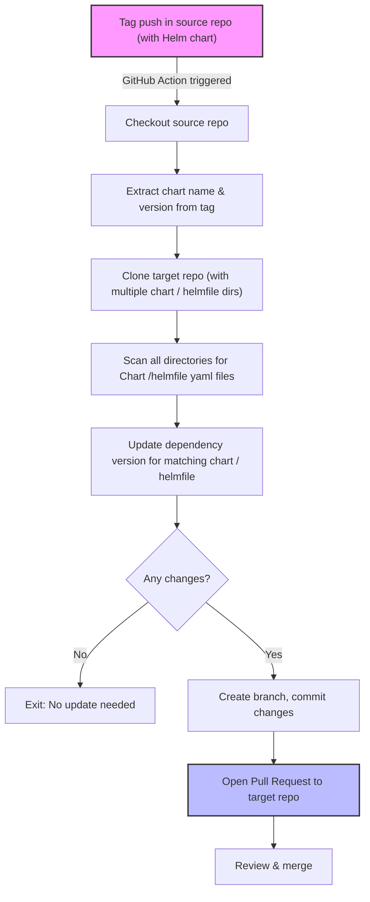

# Update Helm Chart Dependencies GitHub Action

This GitHub Action updates the version of a specific dependency in the `Chart` and `helmfile` yaml files for one or more directories in your repository, creates a branch with the changes, and opens a pull request.

## Action Operation Diagram



## Features

- Accepts a dependency service name and version as inputs.
- Finds all chart directories (optionally filtered by prefix).
- Updates the dependency version in each chart's `Chart` and `helmfile` yaml files if present.
- Creates a new branch from a specified base branch.
- Commits all changes and opens a PR with a summary of updated charts.
- Uses only Node.js built-in modules and the official GitHub Actions toolkit.

## Inputs

| Name                  | Description                                                                                              | Required | Default  |
| --------------------- | -------------------------------------------------------------------------------------------------------- | -------- | -------- |
| `chart-name`          | Name of the dependency to update in Chart / helmfile yaml files.                                         | true     |          |
| `version`             | New version to set for the dependency.                                                                   | true     |          |
| `github-token`        | GitHub token for authentication.                                                                         | true     |          |
| `target-repo`         | Target repository to open the PR in (format: owner/repo).                                                | true     |          |
| `target-chart-prefix` | Prefix to filter chart directories. Only charts whose directory starts with this prefix will be updated. | false    |          |
| `branch`              | Branch to base the PR on (e.g. `master`).                                                                | false    | `master` |

## Usage

```yaml
- name: Update Helm Chart Dependencies
  uses: map-colonies/update-chart-dependency@v1
  with:
    chart-name: 'my-dependency'
    version: '1.2.3'
    github-token: ${{ secrets.GITHUB_TOKEN }}
    target-repo: 'owner/repo'
    target-chart-prefix: 'myservice-'
    branch: 'master'
```

## Notes

- The action updates only the version of the specified dependency in each chart's `Chart` and `helmfile` yaml files.
- The action opens a single PR for all updated charts.
- If no charts require updating, no PR will be opened.

## License

MIT
